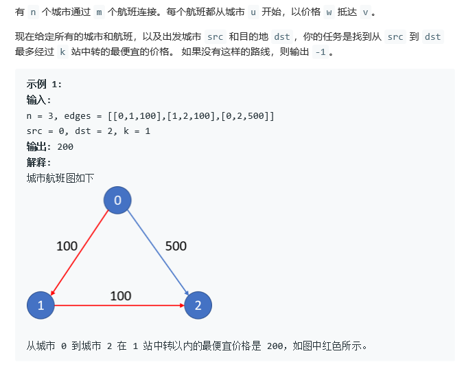

# 动态规划

[TOC]

## 动态规划要点

### 地位

动态规划是高水平面试中经常考察的知识点,因此学习动态规划是性价比非常高的一件事

### 学习维度

一般来说,动态规划演变的类型题非常多,我需要的是题型的递归到记忆化搜索到简单演示推演出来

同时,我会主动忽视要求更加高的进一步优化


## 经典题1:最小路径和

给一个二维数组,数组的每个数字都是正数,要求从左上角到右下角,每一步只能向右或者向下.沿途经过的数字要累加起来,返回最小的路径和

### 普通解法

```java
public int minPath(int[][] matrix){
    return process( matrix,0,0);
}

public int process(int [][] matrix,int i,int j){
    if(i==matrix.length-1&&j==matrix[0].length-1)
        return matrix[i][j];
    
    //这两if顺序不大
    if(i==matrix.length-1)
        return matrix[i][j]+process(matrix,i,j+1);
    if(j==matrix[0].length-1)
        return matrix[i][j]+process(matrix,i+1,j);
    return matrix[i][j]+Math.min(process(matrix,i,j+1),process(matrix,i+1,j))
}

```


### 缓存解法

```java
HashMap<String,Integer> cache=new HashMap<>();
public int process(int [][] matrix,int i,int j){
    if(i==matrix.length-1&&j==matrix[0].length-1)
        return matrix[i][j];
    
    //这两if顺序不大
    else if(i==matrix.length-1){
        int next=0;
        String nextKey=String.valueof(i)+String.valueof(j+1);
        if(cache.containsKey(nextKey))
            next=cache.get(nextKey);
        else
            next=process(matrix,i,j+1);
        result= matrix[i][j]+next;
    }
        
    else if(j==matrix[0].length-1){
         int down=0;
         String downKey=String.valueof(i+i)+String.valueof(j);
         if(cache.containsKey(downKey))
            next=cache.get(downKey);
         else
            next=process(matrix,i+1,j);
        result= matrix[i][j]+next;
    }
    else{
        int next=0;
        int down=0;
        String nextKey=String.valueof(i)+String.valueof(j+1);
        if(cache.containsKey(nextKey))
            next=cache.get(nextKey);
        else
            next=process(matrix,i,j+1);
         
        String downKey=String.valueof(i+i)+String.valueof(j);
         if(cache.containsKey(downKey))
            next=cache.get(downKey);
         else
            next=process(matrix,i+1,j);
        result= matrix[i][j]+Math.min(next,down);
    }

    String key=String.valueof(i)+"-"+String.valueof(j);
    cache.put(key,result);
    return result;
}
```


### 动态规划

```java
public int minPath(int[][] matrix){
    if(matrix==null||matrix.length==0||matrix[0]==null||matrix[0].length==0)
        return 0;
    int row=matrix.length;
    int col=matrix[0].length;
    int[][] dp=new int [row][col];
    dp[row-1][col-1]=matrix[row-1][col-1];
    
    //矩阵最右边界
    for(int i=row-2;i>=0;i--)
        dp[i][0]=dp[i+1][col-1]+matrix[i][col-1];
    //矩阵最下边界
    for(int j=col-2;j>=0;j--)
        dp[0][j]=dp[row-1][j+1]+matrix[row-1][j];
    
    
    for(int i=row-2;i>=0;i--){
        for(int j=col-2;j>=0;j--)
            dp[i][j]=Math.min(dp[i+1][j],dp[i][j+1])+matrix[i][j];
    }
    return dp[0][0];
}
```


## 题型二:数组元素子集是否符合条件

给一个数组arr 和一个正数aim  如果可以选择arr的任意几个元素 看看是否他们的和为aim 返回ture或者false

该数组中的所有数都为正数

### 递归解决

```java
public boolean hasZiJI(int[] arr,int aim){
    return process(arr,0,0,aim);
}
// 数组  当前索引  当前总数 aim
public void boolean process(int[] arr,int i,int sum,int aim){
    //当遍历完所有的可能性的时候
    if(i==arr.length){
        return sum==aim;
    }
    /*
    //当sum已经相等的时候,返回true  不需要继续走了
    if(sum==aim)
    	return true;
    //当i走完全程都没有出现sum==aim的时候,自然返回
    if(i==arr.length)
    	return false;
    */
    return
        //加上该数和不加上该数
        process(arr,i+1,sum,aim)||process(arr,i+1,sum+arr[i],aim);
}
```


### 动态规划

在之前的递归版本中,变化的始终是sum和i  我们唯一的base是当i在最后的时候,sum存在等于aim的时候,也就是说当dp[i] [sum]的dp[arr.length] [aim]为true; 然后进行倒推即可

```java
public boolean hasZIJI(int[] arr,int aim){
    int allsum=0;
    for(int i=0;i<arr.length;i++)
        allsum+=arr[i];
    boolean [][]dp=new boolean[arr.length+1][allsum+1];
    //其他最后一行默认为false
    dp[arr.length][aim]=true;
    for(int i=length-1;i>=0;i--){
        for(int j=allsum;j>=0;j--){
            dp[i][j]=dp[i+1][j];
            //防止越界
            if(j+arr[i]<=allsum){
                dp[i][j]=ap[i][j]||ap[i+1][j+arr[i]];
            }
        }
    }
    return dp[0][0];
}
```

```java
public boolean hasZIJI(int []arr,int aim){
    //简化之前的数组大小 因为数据全部为正数 因此 没有可能在aim以外的数
    boolean [][]dp=new boolean[arr.length+1][aim+1];
    for(int i=0;i<dp.length;i++)
        dp[i][aim]=true;
    //实际上没必要 只要最后一个i为true即可 剩下的自然会在下面的遍历中成功被改变
    for(int i=arr.length-1;i>=0;i--){
        for(int j=aim;j>=0;j--){
            dp[i][j]=dp[i+1][j];
		   if(j+arr[i]<=aim){
               dp[i][j]=dp[i+1][j][j+arr[i]];
           }            
        }
    }
    return dp[0][0];
}
```


## 题型三:背包问题

给定两个数组w和v(weight和value),w[i]表示第i件物品的重量,v[i]表示第i件物品的价值.假设背包的最大承重为bag.要求所能承受最大bag内背包的最大价值应该是多少?

### 递归解决

```java
//最大承重范围内,限制最大重量为bag  背包已经装载alreadyweight
public int process(int[] weights,int[] values,int i,int alreadyweight,int bag){
    if(alreadyweight>bag)
        return Integer.MIN_VALUE;
    //当传送完最后一个 依然没有>bag的时候 此时空物品的价值为0
    if(i==weights.length){
        return 0;
    }
    return Math.max(
        //没放进去的
    	process(weights,values,i+1,alreadyweight,bag),
        //放进去的
        values[i]+process(weights,values,i+1,alreadyweight+weights[i],bag)
    );
}
//一旦超出,返回最小,一比较max 就会出现问题
```

### 状态转移方程

f(i,s)=max(f(i+1,s),v[i]+f(i+1,s+w[i]))

https://blog.csdn.net/huanghaocs/article/details/77920358

### 动态规划

实际上,这是直接根据递归修改的,完全可以不理解其中的含义

```java
public int maxValue(int []weights,int []values,int bag){
    int [][]dp=new int[c.length+1][bag+1];
    //我们本该让最后一行变为0  但是实际上初始化就为0了
    for(int i=c.length-1;i>=0;i--){
        for(int j=bag;j>=0;j--){
            dp[i][j]=dp[i+1][j]; 
            if(j+weights[i]<=bag)
                dp[i][j]=Math(dp[i][j],value[i]+dp[i+1][j+weight[i]]);  
        }
    }
    return dp[0][0];
}
```

### 完全背包问题

`f[i][j] = max{f[i-1][j-k*weight[i]]+k*value[i]} ,其中(0<=k<=j/weight[i])`

### 部分背包问题

`f[i][j] = max{f[i-1][j-k*weight[i]]+k*value[i]} ,其中(0<=k<=min{j/weight[i], num[i]})`

## 题型四:最短路径->航班问题



```java
class Solution {
    public int findCheapestPrice(int n, int[][] flights, int src, int dst, int K) {
       int[][] dp = new int[n][K+1];
        for(int i=0; i<n; i++){
            Arrays.fill(dp[i], Integer.MAX_VALUE);
        }
        Arrays.fill(dp[src], 0);

        for(int[] flight : flights){
            int start = flight[0];
            int end = flight[1];
            int cost = flight[2];
            if(start== src){
                dp[end][0] = cost;
            }
        }
        for(int i=1; i<K+1; i++){
            for(int[] flight : flights){
                int start = flight[0];
                int end = flight[1];
                int cost = flight[2];
                if(dp[start][i-1] != Integer.MAX_VALUE) {
                    dp[end][i] = Math.min(dp[end][i], dp[start][i - 1] + cost);
                }
            }
        }
        return dp[dst][K] == Integer.MAX_VALUE  ? -1 : dp[dst][K];

    }
}
```

