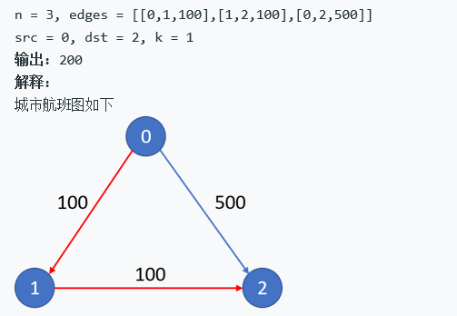

# 回溯思想

## 学习回溯的目的


## 题型1:深度遍历

>  城市和城市之前通过不同的航班进行联系,现在假设有N个城市,给出一组二维数组edge  表示的是,从出发地到结束地花费的车费
>
> 假设我们最多中转K站,求解最终我们花费最少的钱



### 思路解析

首先,我们得找到出发点的路 然后对这些路进行遍历 计算所有可以从start到end的路 如果走完 我们就成功了

限制

* 我们最多中转K站 意味着我们假设走了K次,变换了K个start都无法到达end 那么停止

* 我们的每条路一个地方--其实可以走,但是这样会变多路

  

### 代码分析

```java
	int money=Integer.MAX_VALUE; 
	public int findCheapestPrice(int n, int[][] flights, int src, int dst, int K) {
	     //设置对城市的访问   
	     boolean visited[]=new boolean[n];    
	     process(flights,visited,K,src,dst,0);
        	//注意到最后的返回
	        return money==Integer.MAX_VALUE?-1:money;
	    }

	void process(int [][]flights,boolean visited[],int k,int src,int dst,int nowsum){
	    //当目的地就是出发地 我们总金额就是已经花费的钱
	    if(src==dst){
	  	  money=money<nowsum?money:nowsum;
	      return;
	    }
	    //这个条件是附加的 假设不要求最多转K次 那么就不需要这个条件了
	    if(k<0)
	        return;
	    
	    for(int i=0;i<flights.length;i++){
	        //我们还是无法计算到出发地的时候的所在边,先跳过
	        //当我们已经访问过所在点的时候,跳过
            if(flights[i][0]!=src||visited[flights[i][0]])
	            continue;
	        
            //下面是剪枝
	        //当我们发现当前值加上访问的路更大的时候,跳过哦
	        if(nowsum+flights[i][2]>money)
	            continue;
               
	        visited[flights[i][0]]=true;
	        process(flights,visited,k-1,flights[i][1],dst,nowsum+flights[i][2]);
	        visited[flights[i][0]]=false;
	    }
	}
```

## 题型二:完全排列


```java
ArrayList<ArrayList<Integer>> res = new ArrayList<ArrayList<Integer>>();
public ArrayList<ArrayList<Integer>> permute(int[] num) {
        ArrayList<Integer> item = new ArrayList<Integer>();
        if(num.length==0||num==null)
            return res;
        boolean[] visited = new boolean[num.length];  
        permutation_helper(num,item,visited);
        return res;
    }
    
public void permutation_helper(int[] num, ArrayList<Integer> item,boolean[] visited){
    //1.判断停止条件:当内容相等,加入,退出   
    if(item.size()==num.length){
            res.add(new ArrayList<Integer>(item));
            return;
        }
    //2.如果这个点没有被遍历过,那么加入这个点的同时,标记,然后继续去遍历
    //这里我看看 我发现我说不清楚  假设已经满了 返回的就是最后的元素,那么将他归0即可
        for(int i = 0; i<num.length;i++){
            if(!visited[i]){
                item.add(num[i]);
                visited[i]=true;
                permutation_helper(num,item,visited);
                item.remove(item.size()-1);
                visited[i]=false;
            }
        }
    }
```

