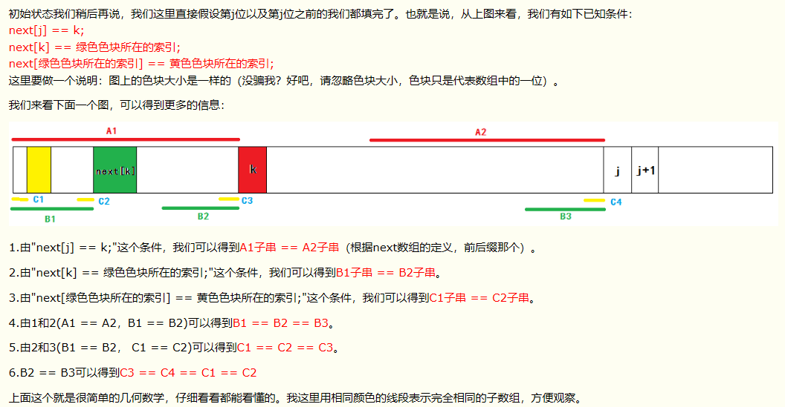

# KMP算法

[TOC]

### 


## 重新理解KMP算法

### 算法解决的问题

1. 关键字符串的查找
1. next数组解决的问题
   1. 一般来说,这类的问题就是在考察F数组的算法


## 普通解决方法

> 对关键字的字符串和源字符串进行比较,发现出现问题,那么源字符串跳转到下一个字符,而关键字字符串从零开始,继续对比,直到关键字字符串完全走完
>
> ``` java
> public int commoncapare(String str1,String str2){
>     char [] ctr1=str1.toCharArray();
>     char [] ctr2=str2.toCharArray();
>     int c1=0,c2=0,l1=0;
>     while(c1!=ctr1.length&&c2!=ctr2.length){
>         //正常的对比
>         int l1=c1;
>         while(ctr1[l1]==ctr2[c2]){
>             l1++;
>             c2++;
>         }
>         //首先检查是否c2已经走完全程,走完全程那么直接退出循环即可
>         if(c2==ct2.length){
>             //返回c1的位置
>             return c1;
>         }
>         
>         //没有走完全程那么,c1移动一个格子,而c2重新归0
>         c2=0;
>         c1++;
>     }
>     return -1;
> }
> ```
>
> 问题:字符串实在太慢了,c1每次都要小步进行,实在不方便

## KMP要如何解决

能否让源字符不再龟速步行,而为线性,不用再回溯了,我们希望c1能够按照l1的步子继续往前走,而不回到之前的c1的下一步

**引入next数组**

原理:

1. next数组实际上是在计算,在一个字符串中,这个字符串上的每一个字符,在每个字符之前的所有子字符串的前缀和后缀相同的个数
2. 之所以需要计算这样一个next数组,是因为
   1. 当我们知晓这样一个数组的时候,我们在进行一一对比的时候(分别从str1的c1节点,str2的0对比)
   2. 我们一旦发现下一个字符不同,我们快速定位找到str2这个字符的后缀的开头k节点,这段开头在str1中也是存在的(否则,就不会对比到这一步了)
   3. 如果,在str1的c1节点到str1中的k节点中,存在可能的字符开头,使得从这样一个字符开头的子字符完全匹配str2,这就意味着,这样一个从str1扒下来的子字符串至少和str2的前缀是相等的
   4. 同时意味着,这样一个字符串也会和str2的后缀相等(因为,我们next中的数组就记录着前缀和后缀相等的长度)
   5. 所以说,知晓了next数组,我们的比较就可以,将str2移到str1对应位置的str2后缀(就是之前对比了相等的那一节),然后,进行str2的前缀的下一个字节和str1的这个出现bug字节进行对比
3. 简化的地方
   1. 首先,我们的str1不再是一次出错,一格一格对比
   2. 其次,我们的str2也不需要再返回0,只需要到前缀的下一个字符


## KMP整体如何实现

```java
//这里,我们返回的是str1开始重复的字串开头在str1的index位置
public int getIndex(String s1,String s2){
    char [] ctr1=str1.toCharArray();
    char [] ctr2=str2.toCharArray();
    char [] next=ctr2.getNextArray();
    int c1=0,c2=0;
    
    while(c1!=ctr1.length&&c2!=ctr2.length){
        //最好不要while中继续嵌套while 换成if
        if(ctr1[c1]==ctr2[c2]){
            //c1不走回头路,因此不需要l1打辅助
            c1++;
            c2++;
        }
        //当发现不符合的时候,重头戏开始
        else{
            //首先,c2会跳槽到前缀的下一个字符
            //假设不存在前缀,那就不用对比了把--归零
            if(next[c2]==-1){
                //next[c2]为-1 说明c2此时必为0 可以直接省略赋值c2
				c1++;
                c2=0;
            }
            //否则,让str2的前缀和str1中和上一个str2一样的后缀重合
            else{
                //next[c2]实际上是已经加了1(数组特性!!!)
                c2=next[c2];
            }
        }   
    }
    return c2==ctr2.length?c1-1-1(c2-1):-1;
}
```

## next数组是如何产生的

其实,我之所以执着于kmp算法,更大的原因是next数组,他的本质是计算一套前缀和后缀相同的方法,这套方法会有很多的含义

他的原理是,人为规定,第一个next元素为-1 第二个next元素为0,之后的元素按照规则来

我们现在可以假设,我们已经知道next[i]为k,因此,next[i+1]的判断,是首先,回到i[k] 也就是第一个前缀之后的字符,比较这个字符和i+1字符的大小,如果相等,next[i+1]为k+1

否则,就麻烦了,因为这意味着,前缀会更短,那么到底会多短呢?

这就得根据

我发现,哥就是个几何习题,一次我们比较的是next[k]是否能和i+1这个字符串能成功,假设可以,那么就在next[k]基础上,next[i+1]=next[k]+1,否则,继续找next[k]值的next[value];

这里,我必须引入一个链接https://www.cnblogs.com/tangzhengyue/p/4315393.html


## next数组的实现

```java
public char[] getNext(String str){
    char [] ctr=str.toCharArray();
    char [] next=new char[ctr.size];
    if(str==null)
        return null;
    if(str.length==1)
        return new char{-1};
    //人为规定
    next[0]=-1;
    next[1]=0;
    int cn=0; //前后缀的重叠数目,我发现不写这个,真的挺难表达的
   	int i=2;
    while(i<=ctr.length){
        //这一段我是超的 我不知道如何表示,真的该好借鉴
        //ctr[cn]为前缀  ctr[i-1]注意一下,这里是因为在上一轮中ctr[i-1]的确没参加比较
        if(ctr[cn]==ctr[i-1])
            next[i++] = ++cn;
        else{
            //我之前一直在纠结,万一为0该怎么办
           if(cn>0)
               cn=next[cn];
            else{
                //当继续为-1的时候,也就是再也找不到前缀的时候
                next[i++]=0;
            }
        }
    }
}
```


## KMP常见习题

### 

> 写一个算法,实现给出一个字符串,能够根据这个字符串获得他的所有的前后缀字符串,进而获得他的长度,比如alala  的前后缀字符串为{a,ala,alala}三个,长度就是3
>
> **解题思路** 
>
> 首先,我们得先扩充这个字符串的长度 +x  也就是alalax 获得x的前缀next为[3]