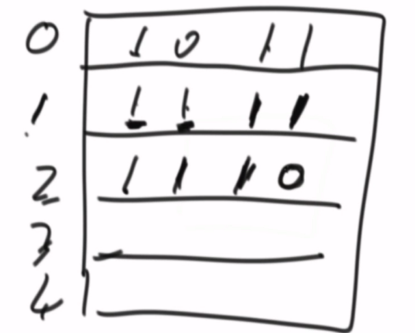

# 单调栈

## 解决的问题

每个位置最近的左边和右边的比他大和比他小的数


## 主要的做法

1. 建立一个堆栈,向其中push数字
2. 当即将要push的数字比栈顶小,直接push进去
3. 当即将要push的数字比栈顶大,开始收集
   1. 首先收集即将push的那个数的信息
   2. 然后弹出栈顶数字
   3. 然后收集原来栈顶元素下面一个元素的信息
   4. 这两个信息就是这个元素的的两个信息
4. 继续3操作,还是那个即将要放进去的数和栈顶比较


## 简单运用

将一个数组转化为一棵树,这个数组满足首先是一个二叉树,数组,没有重复值.并且每个树的父节点都会大于子节点,问如何形成

### 方法一

使用堆,形成平衡二叉树

### 方法二

使用单调栈解决,找到每个数的左边最大值和右边最大值.最终一定会出现两种情况

1. 其中一个数左边和右边都是空 他是最大值
2. 其中一个数左右两边一边为空,一边存在数字
3. 其中一个数左右两边都存在数字 那两边最小的数作为父节点(很重要) 这个证明我有点不想去解释


## 最大直方图

绘制一个完整的直方图,求解以某个坐标轴为高度的最大宽度矩形,比如[1,2,4,6,7] 求解该数组组成的直方图的最大值

这实际上就是非常简单的单调栈习题.接下来一边code一边解释.但是在此之前,我必须意思到的一点是,我这个和单调栈的共性是,我需要求出最近凹凸值,显然,我们这里是要求出一个节点最近的两个比他小的节点,通过这两个节点的距离计算以该中心节点为高度的面积最大为多少

```java
public int maxRecFromBottom(int[] height){
    if(height==null||height.length==0)
        return 0;
    int maxArea=0;
    Stack<Integer>stack=new Stack<>();
    for(int i=0;i<height.length;i++){
        //最开始,堆栈为空,因此直接push进去
        //之后,堆栈不是空,因此,进行判断,发现当前要塞进去的比堆栈要小,因此得结算了
        while(!stack.isEmpty()&&height[i]<=height[stack.peek()]){
            //获得结算的值 height[j]也就是直方图的高度
            int j=stack.pop();
            //假设堆栈为空,那么左边界为-1 否则就是左边界
            int k=stack.isEmpty()?-1:stack.peek();
            //比如当前i为1情况为3 2 那么cur的长度为i-k 也就是1-(-1) 还得减去一个1   
            int curArea=(i-k-1)*height[j];
            maxArea=Math.max(maxArea,curArea);
        }
        stack.push(i);
    }
    //假设是 1 2 3 4 5 6的情况,也就是说此时,我们的最有边界没有最小值了
    while(!stack.isEmpty()){
        int j=stack.pop();
        int k=stack.isEmpty()?-1:stack.peek();
        int curArea=(height.length-k-1)*height[j];
        maxArea=Math.max(maxArea,curArea);
    }
    return maxArea;
}
```


## 最大子矩阵

在一个矩阵中,0和1两个值,尝试求解最大的所有值为1的矩阵

### 解题思路

实际上这个题和求解直方图是类似的,我们首先针对第一行进行求解[1,0,1,0,1....]可以非常顺利的求解出最大的值按照上个例子的思路研究的话

而第二行的数组实际上是第一行的累加,如果第二行基数为0 那么不去累加 基数为0累加为0这一点非常重要,这一定是一个直方图,一定要理解这一点



### 解题代码

```java
public int maxRecSize(int[][] map){
    if(map==null||map.length==0||map[0].length==0){
        return 0;
    }
    int maxArea=0;
    //这里是最重要的和上面的区别,实际上,这里就是在维护这个数组
    int []height=new int[map[0].length];
    for(int i=0;i<map.length;i++){
        for(int j=0;j<map.length;j++){
            //基数为0 直接归0 否则再加上一个
            height[j]=map[i][j]==0?0:height[j]+1;
        }
        maxArea=Math.max(maxRecFromBottom(height),maxArea);
    }
    return maxArea;
}
```


## 环形数组求解

太难了,以后再说吧