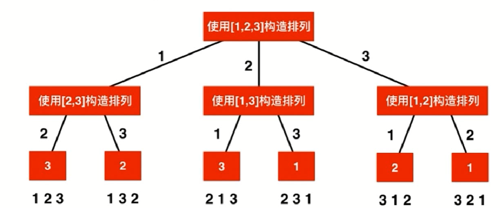
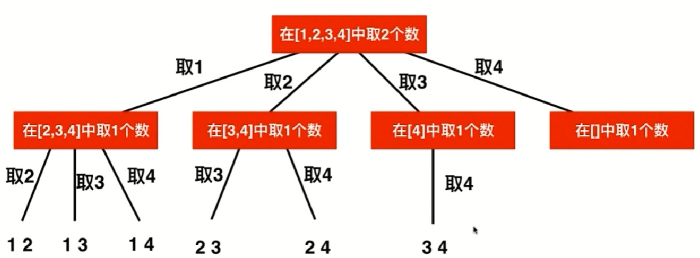

# 排列树

## 对一个数组排列组合

首先,我需要一个容器来装每次不同的数组排列

其次,我需要容器来装每次具体的排列

最后,我需要一个数组判断每次该点我是否遍历过

注意到具体流程





```java
public ArrayList<ArrayList<Integer>> permute(int[] num) {
        ArrayList<ArrayList<Integer>> res = new ArrayList<ArrayList<Integer>>();
        ArrayList<Integer> item = new ArrayList<Integer>();
        
        if(num.length==0||num==null)
            return res;
        boolean[] visited = new boolean[num.length];  
        
        permutation_helper(num,res,item,visited);
        return res;
    }
    
public void permutation_helper(int[] num, ArrayList<ArrayList<Integer>> res, ArrayList<Integer> 							item,boolean[] visited){
    //1.判断停止条件:当内容相等,加入,退出   
    if(item.size()==num.length){
            res.add(new ArrayList<Integer>(item));
            return;
        }
    //2.如果这个点没有被遍历过,那么加入这个点的同时,标记,然后继续去遍历
    //这里我看看 我发现我说不清楚  假设已经满了 返回的就是最后的元素,那么将他归0即可
        for(int i = 0; i<num.length;i++){
            if(!visited[i]){
                item.add(num[i]);
                visited[i]=true;
                permutation_helper(num,res,item,visited);
                item.remove(item.size()-1);
                visited[i]=false;
            }
        }
    }
```


## 对一个数组取出K个数进行组合

具体,从1-n这样的连续数组中,取出k个数,对其进行组合

这个题目和上面的唯一的区别是,上面的数 12 21是两组,而我们这里是不区分组合的

因此,我们的递归图示为:



```java
void generateCombinations(int n,int k,int start,ArrayList<ArrayList<Integer>> res,ArrayList<Integer> item){
    if(item.size()==n){
         res.push(item);
         return; 
    }
    for(int i=start,i<=n;i++){
        item.push(c);
        generateCombinations(n,k,i+1,item);
        item.pop();
    }
    return;
}
```


## 给目标值,从大于0的不重复数组中取值组合

既然是不重复,那么我们可以直接快排然后进行组合即可,但是麻烦的是,他并没有说应该是几个值的和,我这里理解的是固定和就好解决,既然不固定,就会麻烦了

因此,这里我尝试用递归的思路.

* 当我们的array数组中的元素使得target符合的时候,找到一个
* 当array的数组的元素已经大于target的时候,自爆
* 当小于的时候,继续加进去或者不加 观察情况

```java
ArrayList<ArrayList<Integer>> res=new ArrayList<>();
public void generateCombinations(ArrayList<ArrayList<Integer>> res,ArrayList<Integer> item,int[] nums,int sum,int index){
    //这个是工具类,所以是在另外一个方法里面的,因此在外方法中会过滤掉sum=0真实情况 
    if(sum==0){
        res.add(item);
        return;
    }
    //sums超过,或者index超标
    if(sum<0||index=nums.length){
        return;
    }
    if(sum>0){
        //在item中加入值,然后探查加入之后的情况
        item.push(nums[index]);
        generateCombinations(res,item,num,sum-nums[index],++index);
        //不在item中加入值,探查不加入的情况下,往后走的情况
        item.pop(nums[index]);
        index--;//实际上我这一步有点多余 但是好理解啊
        generateCombinations(res,item,num,sum,++index);
    }
}
```

上面的写法是我根据现有的知识完成的,实际上另外一种也比较简洁

实际上,我的第二个解法就是上面题的构思

```java
public void find(int []num,int target,String current_sum,int index){
    if(is_sum_equal(target,current_sum)){
        syso(current_sum);
        return;
    }
    for(int i=index;i<nums.length;i++){
        //如果我们已经取过这个num[i]  那么这个值设置为-1
        if(num[i]!=-1){
        	int val=num[i];
            num[i]=-1;
            //取得num[i]的所有组合
            find(i,num,target,current_sum+val);
            nums[i]=val;
        }       
    }
}
```


##  找出所有符合条件排列的字符串

给出一个n个"(" 和n个")" 让他们进行任意排列,使得最后的形状是符合条件的()()()或者(((())))或者(()()())()()

这个题目实际上是需要进行一波分析的.下面来分析条件

* 在一个String中包含()两个字符,他们出现的次数都为n 并且在任何时候(出现的次数都>=)出现的次数
* 采用递归的方式可以解决问题
  * 当)出现了n次且(出现n次之后,实际上就已经形成了一个完整的符合条件的字符了
  * 当此时匹配的对数pair刚好和(的次数相等,说明(和)已经完全匹配到一起了
    * 此时,下一个出现的字符应该还是(
  * 当(大于)的时候
    * 如果(全部都已经出现了,那么之后的字符必须都是)了
    * 如果(还没出完
      * 情况一为依然出现(
      * 情况二为依然出现)


(和)的数目分别为n个

```java
public void printPair(int left,int right,int paired,int n,int num,String str){
    if(right==n){
        num++;
        syso(str);
        return;
    }
    if(left=right){
        printPair(left++,right,paired,int n,str+'(');
    }
    if(left>right){
        //情况一是继续塞一个left
        printPair(left++,right,paired, n,str+'(');
        //现在返回之前没有塞的状态,我下面的写法是存在问题的,但是意思可以传达
        str.pop('(');
        left--;
        //状态已经回到情况一塞left之前
        //情况二是继续塞一个right,此时,匹配了一对
        printPair(left,right++,paired++,n,str+')');
    }
    if(left<right)
        return;
}
```

https://www.cnblogs.com/kaituorensheng/p/3836757.html

同时也可以站在剩余的角度出发