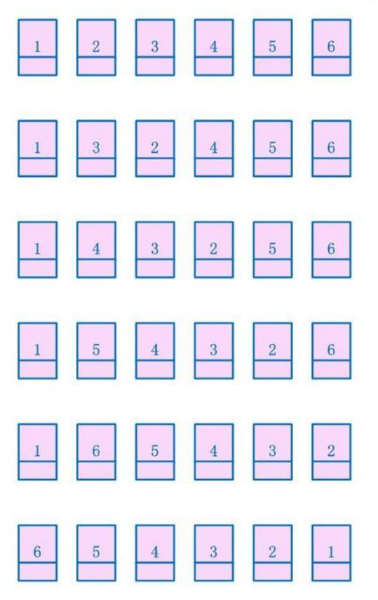

# 链表问题

[TOC]

## 基本结构

```java

public class Node{
	public int value;
	public Node next;
	public Node(int data){
		this.value=value;
	}
}

```


## 删除倒数第K个节点

### 解题思路

​	假设删除(1-2-3-4) 的倒数第4个节点,那么得找到正数第4-4个节点,让它的next=next.next

#### 思路一: 快慢指针

模拟想法:假设是1-2-3-4   需要倒数第1个节点,  那么快指针走1步慢指针原地,然后当快指针走到最后一个,停下.考虑特殊情况:倒数第4个节点,那么快指针走四步,同样解决

#### 思路二: 精确的分析倒数第K个节点的位置

假设我们需要删除倒数第K个节点,那么需要找到这个节点的前面一个位置.

1-2-3-4 我们要找到3,也就是倒数第2个节点,实际上需要找到N-k也就是4-2=2的位置.一旦找到这个位置,久可以让它的next=next.next

关键是:如何求解N-K的位置?

首先,我们遍历一次链表,每次走一步,K--,走完全程,K减了N次,即为K-N  这个数字恰好是我们需要的N-K的负数.此时的K'=K-N

因此,此时,我们重新遍历一次节点,每次遍历的时候,K'++ 直到它为0的时候,我们就走了N-K步

特殊情况: 当K大于N的时候,K'的最大值为正数,此时不存在第K个节点.

​		当K=N的时候,K'的最大值为0 ,倒数第K个,也就是正数第一个,删除头节点,head=head.next

```java
public Node removeLastKthNode(Node head,int lastKth){
	if(head==null||lastKth<1)
		return;
	//接管head
	Node cur=head;
	while(cur!=null){
		lastKth--;
		cur=cur.next;
	}
    if(lastKth>0)
        return head;
    
    //K'为此时的lastKth
	if(lastKth==0)
		head=head.next;
	
	if(lastKth<0){
		//在接管
		cur=head;
		while(++lastKth!=0)
			cur=cur.next;
		cur.next=cur.next.next;
	}
	return head;
}
```


​	

## 链表反转

这是一个高频题目,一定得经常复习

https://blog.csdn.net/feliciafay/article/details/6841115

### 方法1:分为两部分

  ```java
public Node reverseList(Node head){
    
    if(head==null||head.next==null)
        return head;
    //刚开始就断开
    Node pre=head;
    Node next=head.next;
    head.next=null;
    Node tmp=head;//任意值
    
    //好的,现在链表分成了两部分 pre部分是head  next部分是剩下的所有
    while(next!=null){
        //记录下一个指针,然后断后路连接之前的
        tmp=next.next;
       	next.next=pre;
        pre=next;
        next=tmp;
    }
    return pre;
}
  ```

### 方法2: 每次将数字插入到头节点之后



```java

```

方法2我是的确无法用自己的能力写出来,总体思路是,不断的往1之后插入,到最后,最开头的回退.

```java
public Node reverList(Node head){
	Node pre=head;
    Node next=head.next;
    while(head!=null){
       next=head.next;
        head.next=pre;
        pre=head;
        head=next;
    }

}
```

